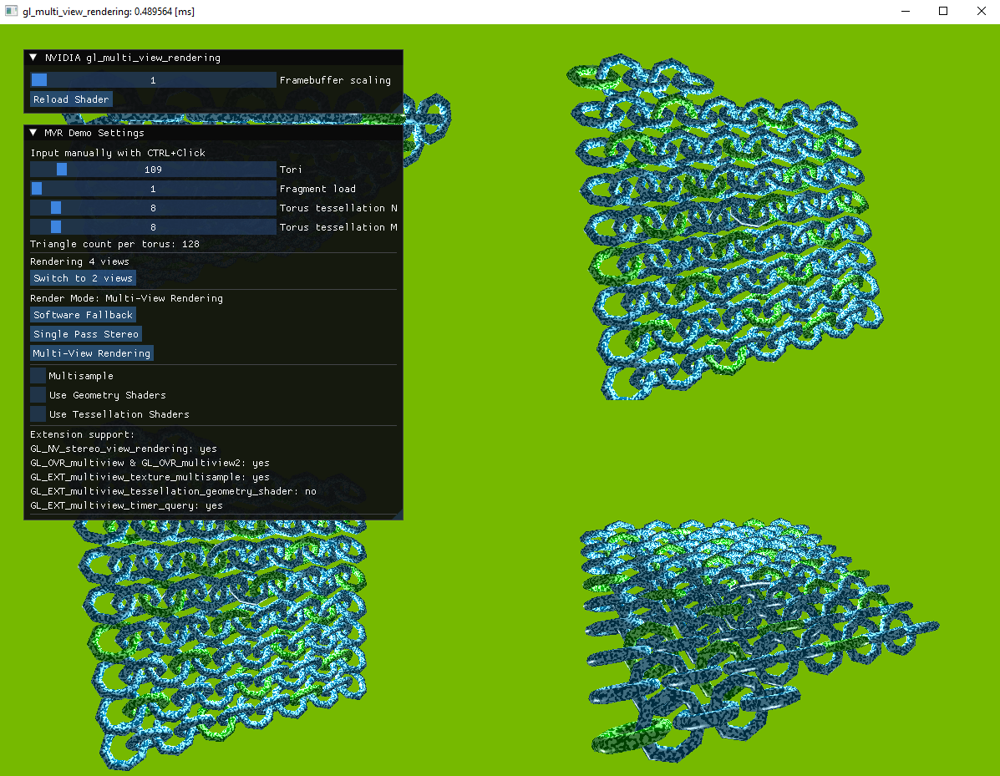

# Multi View Rendering




## This sample shows the functionality of Single Pass Stereo and Multi-View Rendering

This sample shows how to render multiple views (e.g. for VR) with special hardware acceleration. NVIDIA Pascal GPUs (10-series GeForce / Quadro P, introduced in 2016) added "Single Pass Stereo" which allows to render two parallel views (like in a VR HMD) in a single render pass, reducing CPU overhead. NVIDIA Turing GPUs (16-series and 20-series GeForce / Quadro RTX, introduced in 2018) also added "Multi View Rendering", which allows up to 4 views to be generated in hardware with arbitrary poses. This allows not only VR use-cases but also for example the generation of multiple level of shadow maps in one pass.

Both Single Pass Stereo and Multi View Rendering help to reduce geometry load (by avoiding redundant calculations of vertex attributes which do not depend on the view position) and to reduce CPU overhead by reducing the number of draw calls.

The sample allows to scale up the geometry load (by more finely tessellating the tori), the CPU load (by adding more tori), and the fragment load to evaluate the performance benefits between Single Pass Stereo, Multi View Rendering, and the software fallback.

Note that support for Multi View Rendering with Geometry and/or Tessellation Shaders is limited to professional RTX GPUs (formerly known as Quadro).


## Building

Ideally, clone this and other interesting [nvpro-samples](https://github.com/nvpro-samples) repositories into a common subdirectory. You will always need [nvpro_core](https://github.com/nvpro-samples/nvpro_core). The nvpro_core directory is searched either as a subdirectory of the sample, or one directory up.

```
git clone https://github.com/nvpro-samples/nvpro_core.git
git clone https://github.com/nvpro-samples/gl_multi_view_rendering.git

cd gl_multi_view_rendering
mkdir build
cd build
cmake ..
cmake --build .
```

If you are interested in multiple samples, you can use the [build_all](https://github.com/nvpro-samples/build_all) CMake as the entry point; it will also give you options to enable/disable individual samples when creating the solution.

```
git clone https://github.com/nvpro-samples/build_all.git
cd build_all
./clone_all

cd ..
mkdir build
cd build
cmake ../build_all
cmake --build .
```

The most relevant code to understand these extensions is in `MVRDemo.cpp` and `MVRPipeline.cpp`. You will see in `MVRDemo::renderToTexture()` and `MVRDemo::updatePerFrameUniforms()` that the different render modes differ only in the uniform and framebuffer setup as well as the final blitting in `MVRDemo::blitToFramebuffer()`. Everything else is handled by the shaders which use a `viewID` (for the software fallback and Multi View Rendering) or also generate a second view position (`gl_SecondaryPositionNV` for Single Pass Stereo). All modes are supported by the same set of shaders with a few `#ifdef`s (look for defines `STEREO_MVR` and `STEREO_SPS`).


## Further reading

NVIDIA blog articles regarding Single Pass Stereo:
- https://developer.nvidia.com/vrworks/graphics/singlepassstereo

NVIDIA blog articles regarding Multi View Rendering: 
- https://developer.nvidia.com/vrworks/graphics/multiview
- https://developer.nvidia.com/blog/turing-multi-view-rendering-vrworks/

OpenGL extensions Single Pass Stereo:
- GL_NV_stereo_view_rendering https://registry.khronos.org/OpenGL/extensions/NV/NV_stereo_view_rendering.txt

OpenGL extensions Multi View Rendering:
- OVR_multiview https://registry.khronos.org/OpenGL/extensions/OVR/OVR_multiview.txt
- OVR_multiview2 https://registry.khronos.org/OpenGL/extensions/OVR/OVR_multiview2.txt
- EXT_multiview_timer_query https://registry.khronos.org/OpenGL/extensions/EXT/EXT_multiview_timer_query.txt
- EXT_multiview_texture_multisample https://registry.khronos.org/OpenGL/extensions/EXT/EXT_multiview_texture_multisample.txt
- EXT_multiview_tessellation_geometry_shader https://registry.khronos.org/OpenGL/extensions/EXT/EXT_multiview_tessellation_geometry_shader.txt

